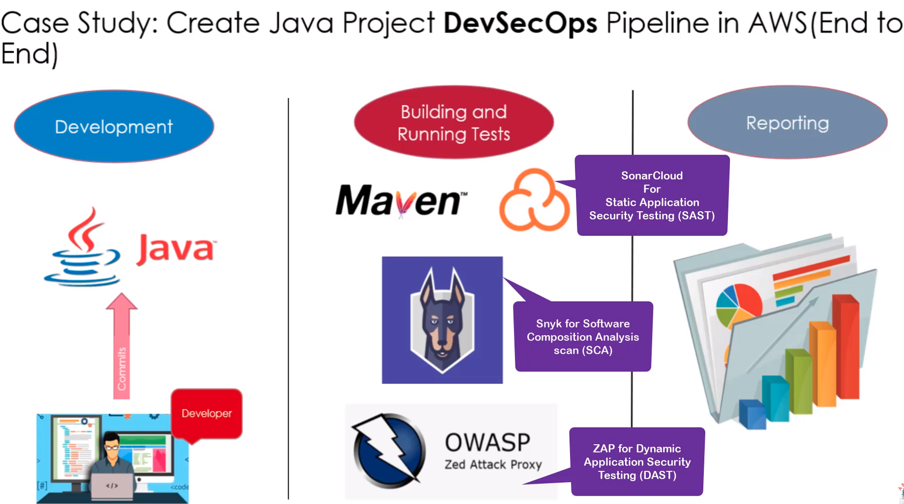
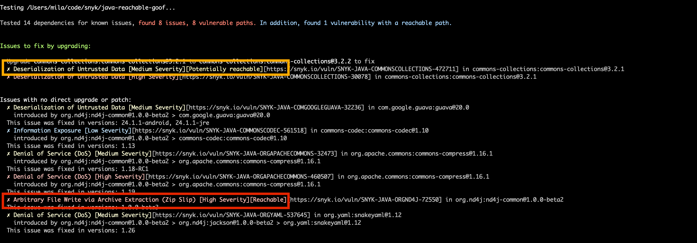
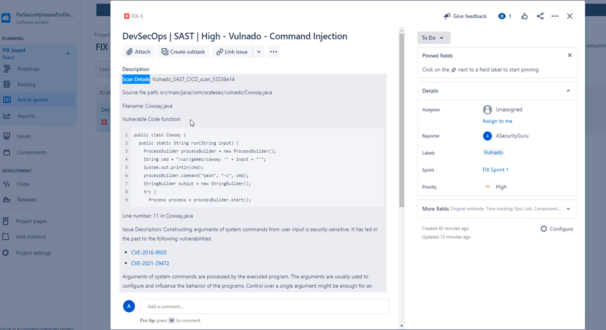
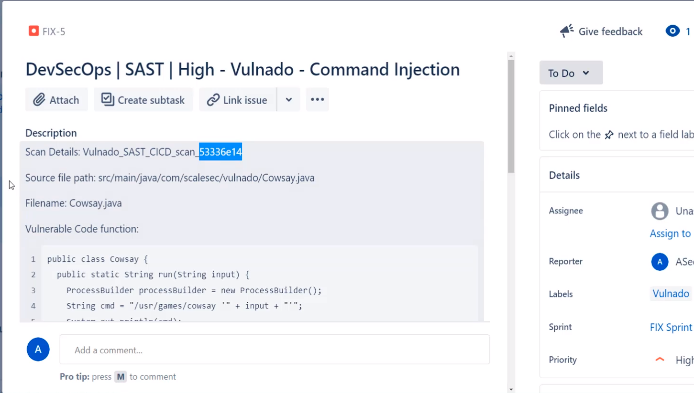
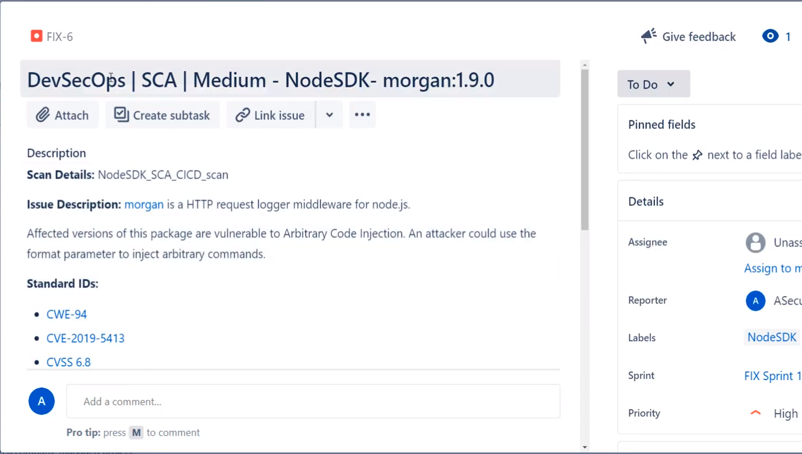
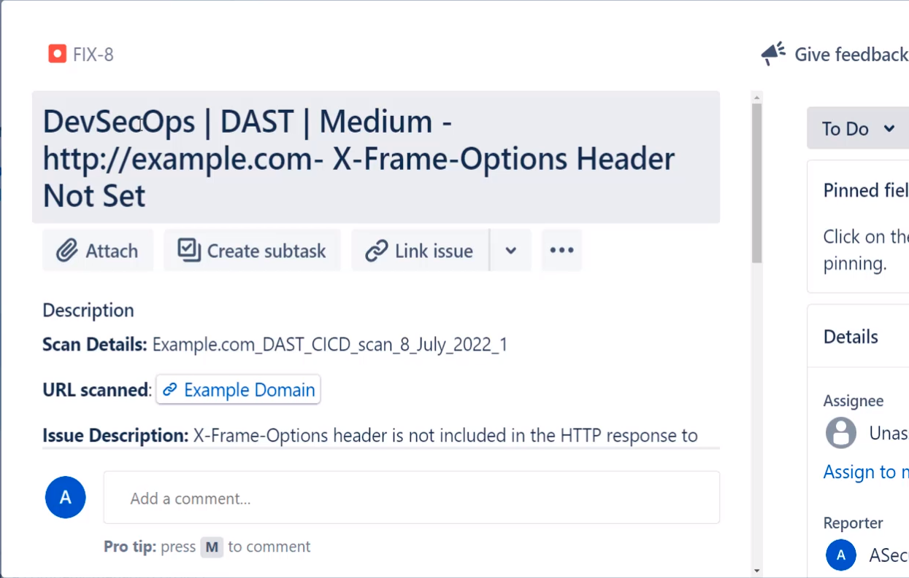

# DevSecOps AWS Pipeline - Continuation

## Overview

Welcome to the DevSecOps AWS Pipeline repository! This project is a continuation of the DevSecOps AWS Terraform
repository ([DevSecOpsAWSTerraform](https://github.com/alexfbasa/DevSecOpsAWSTerraform.git)), focusing on the second
step in our journey to enhance software security and address vulnerabilities.

## Purpose

This repository extends the infrastructure established in the previous Terraform-based DevSecOps setup. Now, we shift
our focus to implementing a robust CI/CD pipeline using AWS CodePipeline, CodeBuild, and other DevSecOps tools. The
pipeline aims to automate security processes, conduct vulnerability scans, and ensure secure deployments.



## Java Reachability Playground - Modified for AWS DevSecOps

This is an intentionally vulnerable application, modified by ASecurityGuru for AWS DevSecOps. The application is
designed to demonstrate the capabilities of Snyk's Reachable Vulnerabilities feature, showcasing both "Reachable" and "
Potentially Reachable" vulnerabilities.

### Included Vulnerabilities

1. **Arbitrary File Write via Archive Extraction:**

- Exploits the ZipSlip vulnerability, resulting in remote command execution. The application creates both good.txt
  and evil.txt during extraction, demonstrating the potential risk.

2. **Deserialization of Untrusted Data:**

- Demonstrates potentially vulnerable code without actual exploitation. Data about vulnerable functions is not
  available.

### How to Run the Demo (Maven)

1. Checkout this repository:

```bash
git clone git@github.com:snyk/java-reachability-playground.git
```

2. Install dependencies:

```bash
mvn install
```

3. Compile the project:

```bash
mvn compile
```

4. Run the main class:

```bash
mvn exec:java -Dexec.mainClass=Unzipper
```

5. Run Snyk command with Reachable Vulnerabilities flag:

```bash
snyk test --reachable
```

or

```bash
snyk monitor --reachable
```

6. View the vulnerability SNYK-JAVA-ORGND4J-72550 marked as reachable along with the function call path to the
   vulnerability.

### For Gradle

1. Build the artifacts:

```bash
./gradlew build
```

2. See test results:

```bash
snyk test --file=build.gradle --reachable
```

or

```bash
snyk monitor --file=build.gradle --reachable
```

**Note:** Once the Java application is run, malicious_file.zip will be deleted. To run it again, run `git checkout .`
prior to the next Java run.

**Note:** Do not forget to add sonar parameters into the [pom.xml](./pom.xml) properties tag.

### Screenshots

#### CLI



#### Snyk UI


### Checking Vulnerabilities with SNYK

- The `snyk:test` goal is executed as part of the Maven build process to identify security issues within third-party
  libraries. The `-fn` flag used in the `mvn snyk:test -fn` in `buildspec.yml` command serves a specific purpose in the
  Maven build process. Let's break down its significance in the context of the provided transcript:

**Command Explanation:**

```bash
mvn snyk:test -fn
```

- The `-fn` flag stands for "fail-never" or "fail-at-end."
- It is used to continue the Maven build process even if there are test failures or issues encountered during the
  execution of the `snyk:test` goal.

**Real-Life Environment Consideration:**

- The transcript explicitly mentions that the use of `-fn` is for demonstration purposes.
- In a real-life environment, the decision to use or omit the `-fn` flag depends on the organization's policies and
  the desired behavior of the CI/CD pipeline.
- Organizations may choose to configure their build processes based on their risk tolerance and the criticality of
  identified issues.

## Reporting Vulnerabilities Issues

As a DevSecOps Engineer, a crucial responsibility involves reporting security and vulnerability issues identified during
the pipeline. This ensures that developers can take prompt action to address and resolve these issues. JIRA, a widely
recognized task monitoring and project management tool, serves as an excellent platform for centralized task management.

### Reporting Security Issues in JIRA

#### Overview:

In this step, we'll guide you through the process of reporting a security issue, specifically a command injection
vulnerability identified through a SAST scan, in JIRA.

### Steps to Report a Security Issue:

1. **Access JIRA Dashboard:**

- Log in to JIRA and access the JIRA dashboard.

2. **Navigate to Backlog:**

- Within the JIRA dashboard, locate and navigate to the "Backlog" section.

3. **Create an Issue:**

- Click on the "Create Issue" option within the backlog.

4. **Open Create Issue Dialog:**
    - Access the three dots on the right side to open the create issue dialogue.

5. **Fill in Details:**

- Complete the required details in the create issue dialog to report the security issue.
- Ensure to select the issue type as "Bug" for security-related concerns.

6. **Provide Specifics:**

- Include details such as the title, type (e.g., command injection), and a comprehensive description of the
  identified issue.

7. **Add Scan Details:**

- Embed relevant scan details, specifying the type of scan (e.g., SAST) and include information about the commit ID
  associated with the CICD scan.

8. **Include Vulnerability Information:**

- Mention the file path, file name, vulnerable code function, and the specific line number where the security issue
  is located.
- Copy relevant information from the scan tool (e.g., SonarCloud) and paste it into the JIRA issue.

9. **References and Mitigations:**

- Provide references and potential mitigations for the identified security issue.
- These references can be sourced from the scan tool used (e.g., SonarCloud).

10. **Specify Details:**

- Add details such as vulnerability category, severity, analyst name, the environment of identification, and
  assignment to the responsible developer.

11. **Set Priority and Sprint:**

- Assign priority levels based on the severity of the security issue.
- Include the bug in the relevant sprint for resolution.

12. **Submit the Report:**

- Click on "Create Issue" to submit the security issue report.

### Post-Reporting Actions:

1. **Issue Assignment:**

- Once the issue is assigned to developers, they move it to the "In Progress" stage.

2. **Developer Fix and Retesting:**

- Developers address the issue and assign it back for retesting.

3. **Verification and Closure:**

- Upon successful retesting, the issue is moved to the "Done" stage, indicating resolution.

### Note:

- **Kanban Board Usage:**
- A Kanban board within JIRA can be employed to visualize and manage the workflow stages of the reported security
  issues.

### Utilizing JIRA for Reporting:

To report security and vulnerability issues, follow these steps:
**Note** Jira has connector with SonarQube which allows to create bug reports automatically.

1. **SonarCloud SAST Vulnerability:**

- Identify and report SAST vulnerabilities using SonarCloud.
- Create a JIRA ticket with details about the identified issues.
- Include relevant information from the SonarCloud report. All the information can be taken from the SonarCloud report
  ex: Commit ID, file path, filename and others.
- 
- 

2. **Snyk SCA Vulnerability:**

- Identify and report SCA vulnerabilities using Snyk.
- Log the details in a dedicated JIRA ticket for SCA issues.
- Attach pertinent information from the Snyk report.
- 

3. **OWASP Zap DAST Vulnerability:**

- Identify and report DAST vulnerabilities using OWASP Zap.
- Document the findings in a JIRA ticket specifically for DAST issues.
- Provide a summary and attach the OWASP Zap vulnerability report.
- 

### Importance of Reporting:

- **Developer Accountability:**
- Reporting vulnerabilities prompts developers to take on the responsibility of addressing and resolving identified
  issues promptly.

- **Centralized Task Management:**
- JIRA serves as a centralized platform for managing and monitoring tasks, making it an ideal choice for tracking
  and resolving security concerns.

- **Holistic Pipeline Oversight:**
- Regular reporting provides a comprehensive overview of security aspects across the DevSecOps pipeline.

By diligently reporting vulnerabilities in a systematic manner, the DevSecOps team contributes to a collaborative and
proactive security culture, ensuring that identified issues are swiftly addressed for the overall security posture of
the software development lifecycle.

## Contributions and Issues

Feel free to contribute to the project by submitting pull requests or reporting any issues you encounter. Let's
collaboratively build a secure and efficient DevSecOps pipeline.

## License

This project is licensed under the [MIT License](LICENSE), allowing you to freely use and modify the codebase for your
needs.

Happy Coding!
